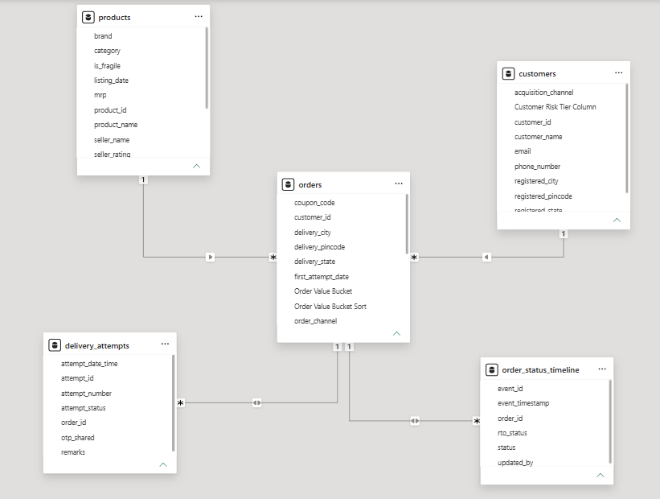

# E-Commerce Return-to-Origin (RTO) Reduction Analysis Dashboard

An end-to-end data analytics project analyzing **16.5K orders** and **₹15.54M in total GMV** using SSMS and Power BI to diagnose operational delivery failures, uncover root-cause risk drivers, and build an executive dashboard.

## Business Problem

The objective was to analyze transaction patterns, logistics timelines, and customer behavior to address high Return-to-Origin (RTO) rates. The project solved key business questions related to:

- Total GMV (**₹15.54M**) and Total RTO Value (**₹1.98M**) across **1.9K RTO orders**
- Overall RTO Rate baseline (**11.5%**)
- Payment mode vulnerability (COD vs. Prepaid)
- High-risk product categories and sizing-sensitive items
- Regional delivery bottlenecks and geographic hotspots
- Customer risk tiering and repeat failure behavior

## Tools Used

- SQL Server Management Studio (SSMS)
- Power BI & DAX Modeling
- Relational Data Modeling (Star Schema & Cross-Filtering)

## Schema



## Project Workflow

1. Extracted and queried raw transactional data using **SSMS (SQL Server Management Studio)**, joining core operational tables (`orders`, `order_status_timeline`, `delivery_attempts`).
2. Loaded raw tables directly into Power BI, establishing proper relational table relationships and data modeling.
3. Created foundational measures in **DAX** to track operational metrics, including:
   - `Total GMV = SUMX('orders', 'orders'[quantity] * 'orders'[unit_price])`
   - `Total Orders = COUNTROWS(DISTINCT('orders'[order_id]))`
   - `Total RTO Orders = CALCULATE(DISTINCTCOUNT('orders'[order_id]), 'order_status_timeline'[rto_status] = "RTO")`
   - `Total RTO Value = CALCULATE([Total GMV], 'order_status_timeline'[rto_status] = "RTO")`
   - `RTO Rate % = DIVIDE([Total RTO Orders], [Total Orders], 0) * 100`
4. Built an interactive dark-mode **Power BI executive dashboard** incorporating conditional heatmapping, matrix tables, and dynamic slicers by state and month.
5. Translated analytical findings into strategic operational recommendations for logistics and checkout guardrails.

## Dashboard


## Key Insights

- Analyzed **16.5K total orders** representing **₹15.54M in GMV**, resulting in **₹1.98M in total RTO losses** at an overall RTO rate of **11.5%**.
- **Payment Method Risk:** Cash on Delivery (COD) orders suffered an alarmingly high **18.8% RTO rate** (compared to total COD orders baseline), whereas Prepaid and Online payment modes remained significantly lower at **4%**.
- **Product Categories:** High-touch categories exhibited the highest return rates, led by **Jewellery & Cosmetics (16%)** and **Women Ethnic Wear (16%)**.
- **Geographic Hotspots:** Delivery failures were heavily concentrated in specific regional logistics hubs, led by top RTO states like **Madhya Pradesh and West Bengal** and cities like **Gwalior and Asansol**.
- **Customer Segmentation:** **546 customers** fell into the **High Risk** tier (exhibiting a $\ge 40\%$ return rate), driving a disproportionate volume of repeat delivery failures out of 1,582 total customers with RTO history.

## Core SQL Analysis Queries

Below are core SQL snippets used in SSMS to extract metrics, evaluate payment risks, and establish customer risk profiles:

### 1. Overall RTO Rate by Financial Value
```sql
WITH distinct_orders AS (
    SELECT order_id, SUM(quantity * unit_price) AS order_value
    FROM (SELECT DISTINCT * FROM orders) o
    GROUP BY order_id
),
rto_orders AS (
    SELECT DISTINCT order_id
    FROM order_status_timeline
    WHERE rto_status = 'RTO'
)
SELECT 
    CEILING(SUM(CASE WHEN r.order_id IS NOT NULL THEN o.order_value ELSE 0 END)) AS total_rto_value,
    CEILING(SUM(o.order_value)) AS total_gmv,
    CEILING(SUM(CASE WHEN r.order_id IS NOT NULL THEN o.order_value ELSE 0 END) * 100.0 / NULLIF(SUM(o.order_value), 0)) AS overall_rto_rate_by_value
FROM distinct_orders o
LEFT JOIN rto_orders r ON o.order_id = r.order_id;
```

### 2. Payment Mode Vulnerability (COD vs. Prepaid)
```sql
SELECT
    COUNT(DISTINCT o.order_id) AS total_orders,
    COUNT(DISTINCT CASE WHEN o.payment_mode = 'Cash On Delivery' THEN o.order_id END) AS total_cod_orders,
    COUNT(DISTINCT CASE WHEN ost.rto_status = 'RTO' THEN ost.order_id END) AS total_rto_orders,
    COUNT(DISTINCT CASE WHEN o.payment_mode = 'Cash On Delivery' AND ost.rto_status = 'RTO' THEN o.order_id END) AS cod_rto_orders,
    CAST(CEILING(100.0 * COUNT(DISTINCT CASE WHEN o.payment_mode = 'Cash On Delivery' AND ost.rto_status = 'RTO' THEN o.order_id END) / COUNT(DISTINCT CASE WHEN o.payment_mode = 'Cash On Delivery' THEN o.order_id END)) AS INT) AS cod_rto_rate
FROM orders o
LEFT JOIN order_status_timeline ost ON o.order_id = ost.order_id;
```

### 3. Customer Risk Tiering Logic
```sql
WITH individual_RTO_rate AS (
    SELECT
        o.customer_id,
        c.customer_name,
        COUNT(o.order_id) AS total_orders,
        COUNT(ost.order_id) AS total_rto_orders,
        ROUND(100.0 * COUNT(ost.order_id) / COUNT(o.order_id), 2) AS rto_rate_percentage
    FROM (SELECT DISTINCT order_id, customer_id FROM orders) o
    JOIN customers c ON o.customer_id = c.customer_id
    LEFT JOIN (SELECT DISTINCT order_id FROM order_status_timeline WHERE rto_status = 'RTO') ost ON o.order_id = ost.order_id
    GROUP BY o.customer_id, c.customer_name
) 
SELECT 
    customer_id,
    customer_name,
    rto_rate_percentage,
    CASE 
        WHEN rto_rate_percentage < 15 THEN 'Low Risk'
        WHEN rto_rate_percentage < 40 THEN 'Medium Risk'
        ELSE 'High Risk'
    END AS Customer_Risk_Tiering
FROM individual_RTO_rate
ORDER BY rto_rate_percentage DESC;
```

## Business Recommendations

- **Implement COD Guardrails:** Introduce mandatory partial prepaid deposits or OTP verification at checkout for COD orders exceeding ₹2,500.
- **Audit Logistics SLAs:** Restructure courier contracts and fulfillment workflows in top failure regional hubs like Gwalior and Asansol.
- **Automated Risk Flagging:** Integrate real-time customer risk tiering at checkout to automatically restrict serial returners ($\ge 40\%$ return rate) to prepaid options only.

## Skills Demonstrated

- Data Extraction & Querying (SSMS / SQL)
- Relational Schema Design (Star Schema)
- Core DAX Measures (`SUMX`, `CALCULATE`, `DIVIDE`)
- Executive Dashboard Design & Data Visualization
- Business Analysis & Risk Mitigation Strategy
